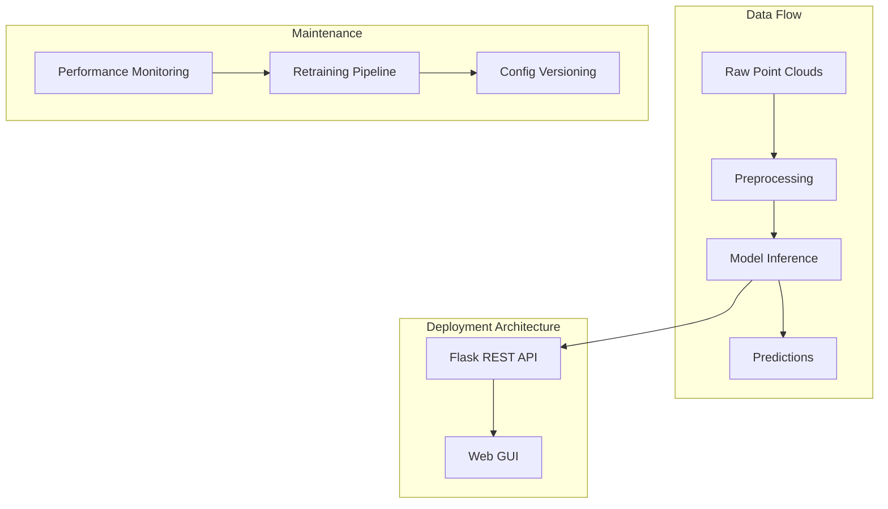

# Model Operations (ModelOps)

This document describes the deployment architecture, model maintenance plan, and parameter update process for the mmWave Radar Human Identification Platform.

---

## 1. Deployment Architecture

### 1.1 High-Level Architecture

```
┌─────────────────────────────────────────────────────────────────────────┐
│                        DEPLOYMENT ARCHITECTURE                            │
├─────────────────────────────────────────────────────────────────────────┤
│                                                                          │
│   ┌──────────────┐     ┌──────────────┐     ┌──────────────────────┐   │
│   │  Raw Point   │     │ Preprocessing│     │   Model Inference     │   │
│   │  Clouds      │────▶│  Pipeline    │────▶│   (Classification /   │   │
│   │  (mmWave)    │     │  (normalize, │     │    Autoencoder)      │   │
│   └──────────────┘     │   augment)   │     └──────────┬───────────┘   │
│                        └──────────────┘                │                │
│                                                         ▼                │
│   ┌──────────────┐     ┌──────────────┐     ┌──────────────────────┐   │
│   │  Web GUI     │◀────│ Flask REST   │◀────│   Predictions /      │   │
│   │  (Frontend)  │     │  API         │     │   Reconstructions    │   │
│   └──────────────┘     └──────────────┘     └──────────────────────┘   │
│                                                                          │
└─────────────────────────────────────────────────────────────────────────┘
```

### 1.2 Component Description

| Component | Technology | Role |
|-----------|------------|------|
| **Data Source** | mmWave Radar / FAUST mesh | Raw 3D point cloud input |
| **Preprocessing** | NumPy, custom pipeline | Normalize, sample 200 points, augment |
| **Model Inference** | PyTorch | Classification (PointNet++) or Reconstruction (AE) |
| **API Layer** | Flask | REST endpoints for inference, training status |
| **Frontend** | HTML/JS/CSS | Web GUI for configuration and monitoring |
| **Container** | Docker + Docker Compose | Portable deployment |

### 1.3 Deployment Flow

1. **Build**: `docker-compose build` creates the application image.
2. **Run**: `bash start.sh` or `docker-compose up` starts backend + frontend.
3. **Access**: Users open `http://localhost:8080` for the GUI.
4. **Inference**: Point clouds are sent via API, preprocessed, passed to the model, and results returned.

### 1.4 Mermaid Diagram



---

## 2. Model Maintenance Plan

### 2.1 Monitoring Metrics

| Metric | Target | Action if Degraded |
|--------|--------|-------------------|
| **Validation Accuracy** (Classification) | > 70% | Trigger retraining |
| **Chamfer Distance** (Autoencoder) | < 0.01 | Review data quality |
| **Inference Latency** | < 100ms per sample | Optimize or scale |
| **Data Drift** | Monitor distribution shift | Collect new data, retrain |

### 2.2 Retraining Triggers

- **Scheduled**: Quarterly retraining with latest data.
- **Performance drop**: Validation accuracy drops > 5% vs. baseline.
- **New subjects**: When new identities are added to the system.
- **Data drift**: Significant change in point cloud statistics (e.g., new sensor).

### 2.3 Retraining Pipeline

1. **Data collection**: Ensure new/updated point clouds in `data/raw/`.
2. **Preprocessing**: Run `python src/train.py` or use GUI to regenerate `data/processed/`.
3. **Training**: Execute `bash train_all_models.sh` or train via GUI.
4. **Validation**: Run `python src/evaluate.py --compare` to verify metrics.
5. **Deployment**: Replace `results/checkpoints/<model>/model_best.pth` with new checkpoint.
6. **Rollback**: Keep previous checkpoint as `model_previous.pth` for quick revert.

---

## 3. Parameter Update Process

### 3.1 Configuration Management

- **File**: `config.yaml` holds all hyperparameters.
- **Versioning**: Track `config.yaml` in Git; tag releases (e.g., `v1.0-config`).
- **Override**: Support environment variables or CLI args for deployment-specific overrides.

### 3.2 Key Parameters and Update Guidelines

| Parameter | Location | Update Process |
|-----------|----------|----------------|
| `learning_rate` | config.yaml | Reduce if loss oscillates; increase if convergence is slow |
| `batch_size` | config.yaml | Increase for faster training if GPU memory allows |
| `num_epochs` | config.yaml | Extend if validation still improving at end |
| `dropout` | config.yaml | Increase if overfitting (train >> val accuracy) |
| `early_stopping_patience` | config.yaml | Increase to allow longer training |

### 3.3 A/B Testing for New Models

1. **Train challenger**: Train new model (e.g., different architecture).
2. **Evaluate**: Compare with champion via `evaluate.py --compare`.
3. **Shadow deployment**: Run challenger in parallel, log predictions without serving.
4. **Promote**: If challenger outperforms champion on validation + shadow metrics, replace champion.

### 3.4 Rollback Procedure

1. Restore previous checkpoint: `cp model_previous.pth model_best.pth`.
2. Restart API/container if needed.
3. Verify inference with a small test set.
4. Document incident and root cause.

---

## 4. References

- **Docker**: https://docs.docker.com/
- **Flask**: https://flask.palletsprojects.com/
- **PyTorch Model Serving**: https://pytorch.org/serve/
