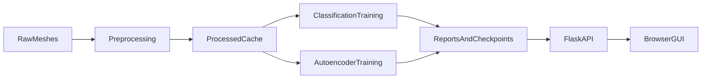

# Model Operations (ModelOps)

This document summarizes how the current repository is operated as a small point-cloud ML platform.

## 1. System Overview
The repository supports both experimentation and demonstration. Raw FAUST meshes are loaded from disk, converted into processed point clouds, then used for either classification or autoencoder training. The same core ML code is accessible through both CLI scripts and a Flask-backed GUI.



## 2. Main Components
| Component | Technology | Responsibility |
| --- | --- | --- |
| Data source | FAUST meshes | Input geometry for all current experiments |
| Preprocessing | Python, NumPy, custom dataset code | Sampling, centering, normalization, caching |
| Training | PyTorch | Classification and autoencoder training |
| API | Flask | Job creation, status polling, report download |
| Frontend | HTML, JS, CSS | Browser workflow for training and monitoring |
| Packaging | Docker, Docker Compose | Reproducible startup for the GUI stack |

## 3. Supported Models
Classification:

- `mlp`
- `cnn1d`
- `pointnet`

Autoencoder:

- `mlp_ae`
- `pointnet_ae`

The repository no longer treats `mmidnet` as an implemented runtime option. It may still be relevant as background inspiration, but it is not a selectable model in the current workflow.

## 4. Active Operating Assumptions
Current source-of-truth settings come from `config.yaml`:

- `data.num_points = 500`
- `data.normalize_center = true`
- `data.normalize_scale = false`
- `augmentation.normalize = false`
- `augmentation.rotation_range = 360`
- `augmentation.translation_range = 0.0`
- classification training batch size = 64
- autoencoder training batch size = 64

These values should stay aligned with README, report, and presentation materials whenever outputs are regenerated.

## 5. Standard Workflow
### GUI workflow
1. Run `bash start.sh`.
2. Open `http://localhost:8080`.
3. Upload or reuse FAUST meshes.
4. Preprocess data.
5. Select classification or autoencoder mode.
6. Start training and monitor progress.
7. Generate and download artifacts.

### CLI workflow
```bash
python src/train.py --config config.yaml --model pointnet
python src/evaluate.py --compare --models mlp cnn1d pointnet
python src/train_ae.py --config config.yaml --model pointnet_ae
python src/evaluate_ae.py --config config.yaml --compare
```

## 6. Monitoring and Artifacts
Current outputs include:

- checkpoints in `results/checkpoints/`
- JSON reports in `results/reports/`
- comparison tables in `results/model_comparison.csv` and `results/ae_comparison.md`
- experiment summaries in `results/experiments/summary_report.txt`
- TensorBoard logs in `results/tensorboard/`

Useful monitoring signals:

- classification validation accuracy
- classification ROC-AUC
- autoencoder validation Chamfer Distance
- training and validation loss curves

## 7. Maintenance Guidelines
Use the following conditions as retraining triggers:

- preprocessing settings change
- new data is added to `data/raw/`
- performance falls below the current PointNet / PointNet AE baselines
- a new experiment changes the recommended champion model

When changing model or preprocessing settings:

1. regenerate the processed dataset if necessary
2. retrain the relevant models
3. regenerate comparison tables
4. update README, report, and presentation with the new measured outputs

## 8. Limitations
- The platform currently uses FAUST rather than true radar point clouds.
- The GUI report format is JSON, not a polished publication artifact.
- The backend is oriented toward training-job orchestration rather than production inference serving.

## 9. References
- Docker: https://docs.docker.com/
- Flask: https://flask.palletsprojects.com/
- PyTorch: https://pytorch.org/
